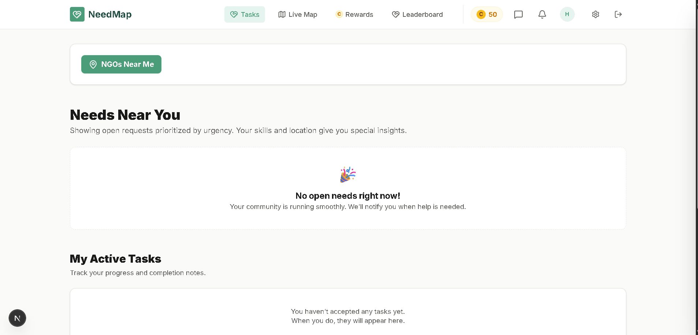
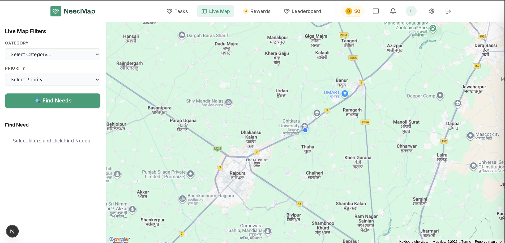
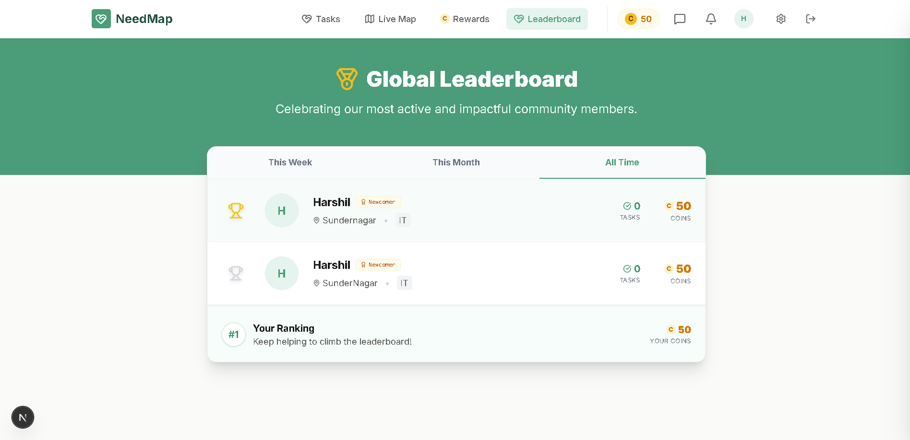
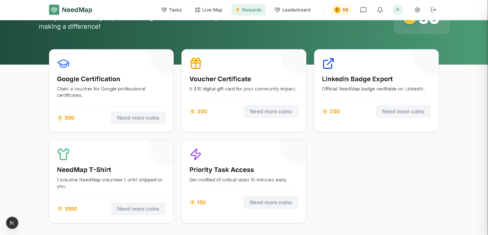
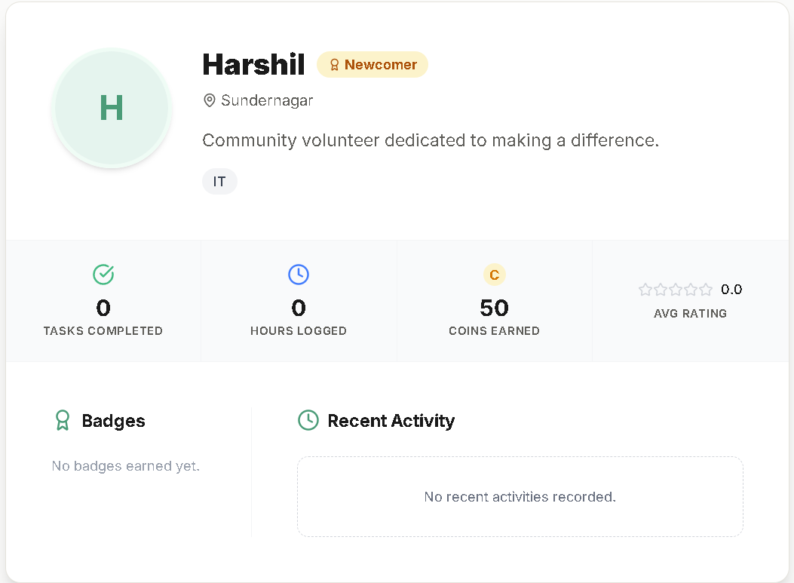

# 🌍 NeedMap

> Smart resource allocation platform connecting NGOs and volunteers using AI + real-time location intelligence.

---

## 🚀 Overview

NeedMap is a data-driven ecosystem designed to eliminate coordination gaps between NGOs and volunteers. By combining real-time mapping with AI-powered classification, the platform ensures that urgent needs are identified, prioritized, and resolved efficiently.

---

## 🎯 Problem

- **Communication Gaps:** NGOs struggle to broadcast real-time requirements to volunteers  
- **Discovery Friction:** Volunteers lack visibility into where help is needed most  
- **Inefficient Allocation:** Manual coordination delays response and wastes resources  

---

## 💡 Solution

NeedMap centralizes coordination through:

- 📍 **Real-time spatial visualization** for instant situational awareness  
- 🤖 **AI-driven classification** to categorize and prioritize needs  
- 💬 **Direct communication channels** between NGOs and volunteers  
- 🚀 **Smart navigation** to reduce logistical friction  

---

## 🔥 Key Features

### 🗺️ Live Map System
- Real-time visualization of needs and NGOs  
- Location-based filtering for local impact  

### 📍 NGOs Near Me
- Discover nearby NGOs instantly  
- Contact via call, email, or chat  

### 💬 Real-Time Chat
- Seamless NGO ↔ volunteer communication  
- Context-aware conversation system  

### 🤖 AI Classification (Gemini)
- Automatic need categorization  
- Priority-based sorting for faster response  

### 🚀 Smart Navigation
- One-click navigation to need location  
- Integrated with Google Maps  

### 📊 NGO Dashboard
- Track needs lifecycle (Open → In Progress → Resolved)  
- Monitor activity and engagement  

---

## 🛠️ Tech Stack

- **Frontend:** Next.js 15 (App Router), React 19, Tailwind CSS  
- **Backend:** Firebase (Auth, Firestore, Storage)  
- **AI:** Google Gemini API  
- **Maps:** Google Maps Platform  
- **UI/UX:** Framer Motion, Lucide Icons  

---

## 📸 Screenshots

### 🧑‍💻 NGO Dashboard


### 🗺️ Live Map


### 🏆 Leaderboard


### 🎁 Rewards


### 👤 User Profile


---

## ⚙️ Setup Instructions

### 1. Clone the repository
```bash
git clone https://github.com/needmap26/needmap.git
cd needmap
```

### 2. Install Dependencies
```bash
npm install
```

### 3. Configure Environment Variables
Create a `.env.local` file in the root directory and add your credentials:
```env
NEXT_PUBLIC_FIREBASE_API_KEY=your_key
NEXT_PUBLIC_FIREBASE_AUTH_DOMAIN=your_domain
NEXT_PUBLIC_FIREBASE_PROJECT_ID=your_project_id
NEXT_PUBLIC_FIREBASE_STORAGE_BUCKET=your_bucket
NEXT_PUBLIC_FIREBASE_MESSAGING_SENDER_ID=your_sender_id
NEXT_PUBLIC_FIREBASE_APP_ID=your_app_id

NEXT_PUBLIC_GOOGLE_MAPS_API_KEY=your_maps_key
GOOGLE_AI_API_KEY=your_gemini_key
```

### 4. Run Development Server
```bash
npm run dev
```
Open [http://localhost:3000](http://localhost:3000) to view the application.

## 📌 Future Improvements

*   **Route Optimization:** Multi-stop navigation for high-efficiency volunteer runs.
*   **Verification 2.0:** Blockchain-based NGO credentialing.
*   **Push Notifications:** Instant alerts for ultra-urgent needs in the user's vicinity.
*   **Predictive AI:** Anticipating needs based on historical data and seasonal trends.

## 👤 Author

**Harshil Sanmber**  
*Founder & Lead Developer — NeedMap*

## 📄 License

This project is licensed under the MIT License - see the [LICENSE](LICENSE) file for details.

## 🙏 Acknowledgments

*   Built with **Next.js** and **Firebase**.
*   AI intelligence powered by **Google Gemini**.
*   UI/UX crafted with **Tailwind CSS**.
